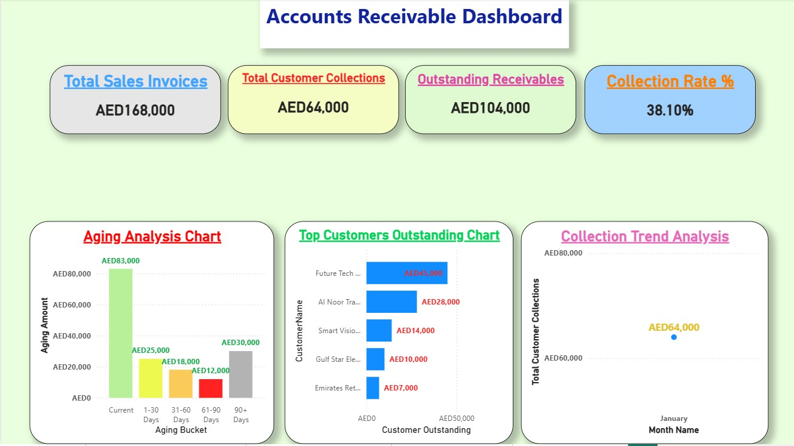
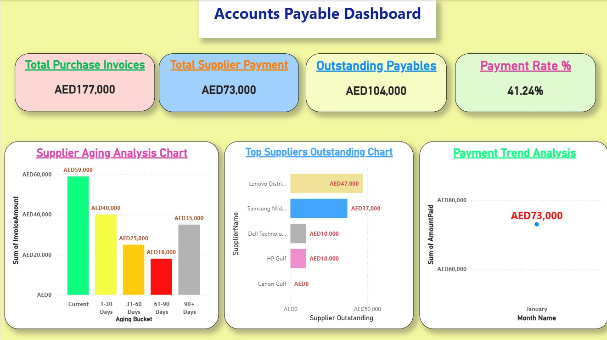
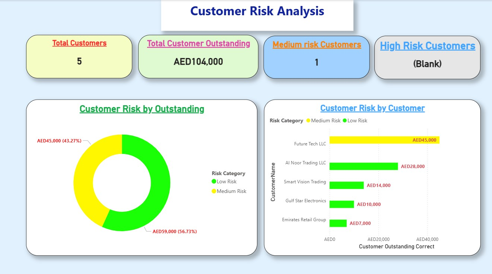
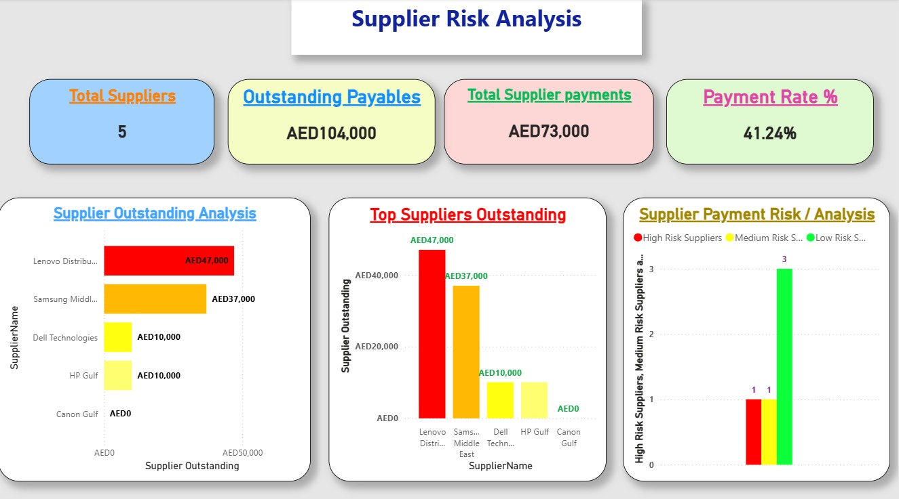
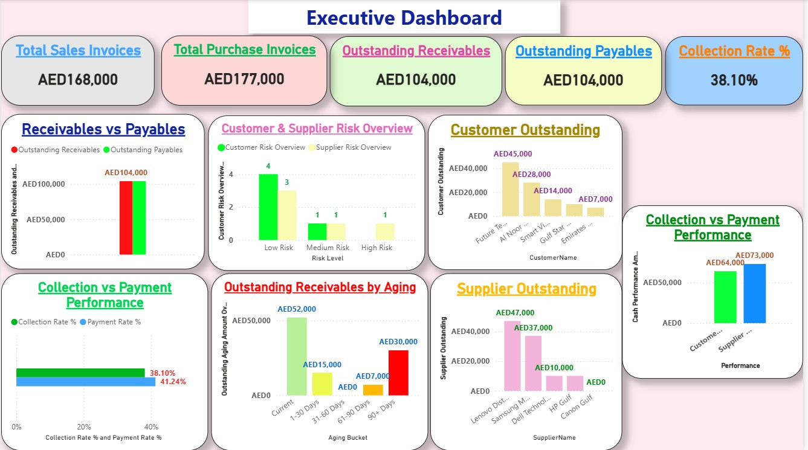

📊 Accounts Receivable & Payable Analytics Dashboard | Power BI

📌 Project Overview

This project is an interactive Accounts Receivable & Payable Analytics Dashboard developed to transform accounting transaction data into clear, actionable financial insights.

The dashboard combines accounting knowledge, data analysis, data transformation, and business intelligence to help management monitor customer receivables, supplier payables, collections, payments, aging, outstanding balances, and customer and supplier risk.

The project was developed using Microsoft Excel, Power Query, Power BI, and DAX.

🎯 Project Objectives

The main objectives of the project are to:

- Analyze outstanding customer receivables.
- Analyze outstanding supplier payables.
- Monitor customer collections and supplier payments.
- Calculate Collection Rate and Payment Rate.
- Identify overdue customer invoices using Aging Analysis.
- Classify customers and suppliers according to risk levels.
- Analyze sales and purchase trends.
- Provide management with interactive financial KPIs and insights.
- Combine accounting principles with data analysis and Business Intelligence.

💼 Business Problem

Companies need accurate and timely information about:

- How much money is still owed by customers.
- How much the company owes to suppliers.
- Which customer invoices are overdue.
- How effectively customer collections are being managed.
- How effectively supplier payments are being managed.
- Which customers or suppliers may represent higher financial risk.

Traditional accounting reports can provide the numbers, but interactive dashboards make it easier to monitor, analyze, compare, and identify areas requiring management attention.

This project addresses these requirements through an interactive Power BI solution.

🗂️ Data Structure

The project uses structured accounting and transaction data, including:

Customers Master Data

Contains customer information used for customer analysis and risk classification.

Suppliers Master Data

Contains supplier information used for supplier analysis and risk classification.

Sales Invoices

Contains customer invoice transactions, including invoice numbers, invoice dates, due dates, and invoice amounts.

Purchase Invoices

Contains supplier purchase transactions, including invoice numbers, invoice dates, due dates, and invoice amounts.

Customer Receipts

Contains customer collection transactions and amounts received against invoices.

Supplier Payments

Contains supplier payment transactions and amounts paid against supplier invoices.

Chart of Accounts

Contains accounting account codes, account names, and account classifications.

Calendar Table

Used for date analysis, monthly trends, and time-based reporting in Power BI.

🧹 Data Preparation

The accounting data was prepared and transformed before being used for dashboard analysis.

The data preparation process included:

- Reviewing the accounting data structure.
- Cleaning and organizing transaction data.
- Checking data consistency.
- Standardizing data types.
- Preparing dates for time-based analysis.
- Preparing customer and supplier master data.
- Preparing invoice and payment data for analysis.

🔄 Power Query

Power Query was used to prepare and transform the accounting data before loading it into the Power BI data model.

Key activities included:

- Data cleaning.
- Data transformation.
- Data type management.
- Query preparation.
- Structuring accounting tables for analysis.
- Preparing data for relationships and DAX calculations.

🧩 Data Model

A structured Power BI data model was created to connect accounting transactions with the relevant master and calendar data.

The model supports analysis of:

- Customers.
- Suppliers.
- Sales invoices.
- Purchase invoices.
- Customer receipts.
- Supplier payments.
- Dates.
- Accounting classifications.

The model was designed to support reliable filtering, aggregation, and financial analysis.

🧮 DAX & Financial Measures

DAX was used to create financial and analytical measures for the dashboards.

Key measures include:

- Outstanding Receivables.
- Outstanding Payables.
- Customer Collections.
- Supplier Payments.
- Collection Rate %.
- Payment Rate %.
- Aging Amount.
- Customer Outstanding.
- Supplier Outstanding.
- High Risk Customers.
- Medium Risk Customers.
- Low Risk Customers.
- High Risk Suppliers.
- Medium Risk Suppliers.
- Low Risk Suppliers.
- Total Suppliers.

These measures support interactive KPI cards and analytical visuals.

⏳ Aging Analysis

The project includes an Outstanding Receivables Aging Analysis.

Customer invoices are classified into five aging categories:

Aging Bucket| Description
Current| Not overdue
1–30 Days| 1 to 30 days overdue
31–60 Days| 31 to 60 days overdue
61–90 Days| 61 to 90 days overdue
90+ Days| More than 90 days overdue

The Aging Analysis helps management identify overdue receivables and prioritize collection follow-up.

💰 Collection Analysis

Customer collection performance is monitored using:

Collection Rate % = Customer Collections ÷ Total Sales Invoices × 100

For the project data:

- Customer Collections = 64,000
- Total Sales Invoices = 168,000
- Collection Rate = 38.10%

This KPI provides an indication of customer collection performance during the reporting period.

💳 Supplier Payment Analysis

Supplier payment performance is monitored using:

Payment Rate % = Supplier Payments ÷ Total Purchase Invoices × 100

For the project data:

- Supplier Payments = 73,000
- Outstanding Payables = 104,000
- Payment Rate = 41.24%

This analysis helps monitor supplier payment activity and outstanding obligations.

⚠️ Customer & Supplier Risk Analysis

The project includes risk classification for both customers and suppliers.

Customer Risk

Customers are classified into:

- 🟢 Low Risk Customers
- 🟡 Medium Risk Customers
- 🔴 High Risk Customers

Supplier Risk

Suppliers are classified into:

- 🟢 Low Risk Suppliers
- 🟡 Medium Risk Suppliers
- 🔴 High Risk Suppliers

For suppliers, the project identifies:

- High Risk Suppliers = 1
- Medium Risk Suppliers = 1
- Low Risk Suppliers = 3

The risk analysis helps management identify entities that may require closer monitoring and follow-up.

---

📊 Dashboard Analysis

The Power BI project contains interactive analysis covering:

Customer Analysis

- Customer Outstanding Analysis.
- Customer Collections.
- Collection Rate.
- Customer Risk Analysis.

Supplier Analysis

- Supplier Outstanding Analysis.
- Supplier Payments.
- Payment Rate.
- Supplier Risk Analysis.

Aging Analysis

- Current.
- 1–30 Days.
- 31–60 Days.
- 61–90 Days.
- 90+ Days.

Trend Analysis

- Sales vs Purchase Trend Analysis.
- Monthly financial activity.

Executive Analysis

- Executive Financial Dashboard.
- Key financial KPIs.
- Management-level financial insights.

📈 Key Project KPIs

The project includes important KPIs such as:

KPI| Project Result
Outstanding Receivables| 104,000
Outstanding Payables| 104,000
Customer Collections| 64,000
Supplier Payments| 73,000
Collection Rate| 38.10%
Payment Rate| 41.24%
Total Suppliers| 5

These KPIs provide a quick overview of receivables, payables, collections, payments, and supplier risk.

🔍 Key Insights

The dashboard provides management with the ability to:

- Monitor outstanding customer balances.
- Monitor outstanding supplier balances.
- Identify overdue receivables.
- Analyze customer collection performance.
- Analyze supplier payment performance.
- Identify higher-risk customers and suppliers.
- Compare sales and purchase activity.
- Support follow-up and working-capital decisions.
- Convert accounting transaction data into actionable business insights.

🛠️ Tools & Technologies

Accounting & Financial Analysis

- Accounts Receivable (AR)
- Accounts Payable (AP)
- Aging Analysis
- Collections Analysis
- Payments Analysis
- Outstanding Balance Analysis
- Customer Risk Analysis
- Supplier Risk Analysis
- Financial Analysis

Data Analysis & Business Intelligence

- Microsoft Power BI
- DAX
- Power Query
- Microsoft Excel
- Data Cleaning
- Data Transformation
- Data Modeling
- KPI Development
- Dashboard Development
- Business Intelligence

AI

- AI-Assisted Data Analysis
- ChatGPT
- AI Tools for Accounting & Financial Analysis

🖼️ Dashboard Screenshots

Accounts Receivable Dashboard

Accounts Payable Dashboard

Customer Risk Analysis

Supplier Risk Analysis

Executive Financial Dashboard

📄 Project Documentation

A PDF version of the project documentation is available here:

"View / Download Project PDF" (PDF/ Account_Receivable_Payable_Analytic_Dashboard.pdf)

The PDF contains the project overview, data structure, data preparation, data model, DAX measures, dashboard analysis, KPIs, and key insights.

🎥 Project Video

A project demonstration video will be added to this repository.

The video will demonstrate:

- Power BI Desktop Dashboard.
- Key KPIs.
- Receivables and Payables Analysis.
- Aging Analysis.
- Customer & Supplier Risk Analysis.
- Executive Dashboard.
- Power BI Mobile Layout 📱.

Video: Coming Soon

📁 Project Files

The repository contains the following project resources:

Project/
    Account_Receivable_Payable_Analytic_Dashboard.pbix

Screenshots/
    Accounts_Receivable_Dashboard.jpg
    Accounts_Payable_Dashboard.jpg
    Customer_Risk_Analysis.jpg
    Supplier_Risk_Analysis.png
    Executive_Dashboard.jpg

PDF/
    Account_Receivable_Payable_Analytic_Dashboard.pdf

Video/
    Account_Receivable_Payable_Analytic_Dashboard.mp4

🎓 Project Skills Demonstrated

This project demonstrates practical experience in:

- Accounting Data Analysis.
- Accounts Receivable Analytics.
- Accounts Payable Analytics.
- Financial Data Analysis.
- Data Cleaning.
- Data Transformation.
- Data Modeling.
- DAX Measure Development.
- Power Query.
- Power BI Dashboard Development.
- KPI Development.
- Aging Analysis.
- Risk Analysis.
- Business Intelligence.
- Management Reporting.

👤 Project Profile

Role: Accounting & Data Analytics Project

Focus:
Accounting | Financial Analysis | Business Intelligence | Power BI | Data Analytics

Tools:
Microsoft Excel | Power Query | Power BI | DAX | AI-Assisted Analysis

---

📌 Disclaimer

This project is a portfolio and learning project created for demonstration of accounting, data analysis, and business intelligence skills.

The data is used for analytical and educational purposes and does not represent confidential information from a real company.
